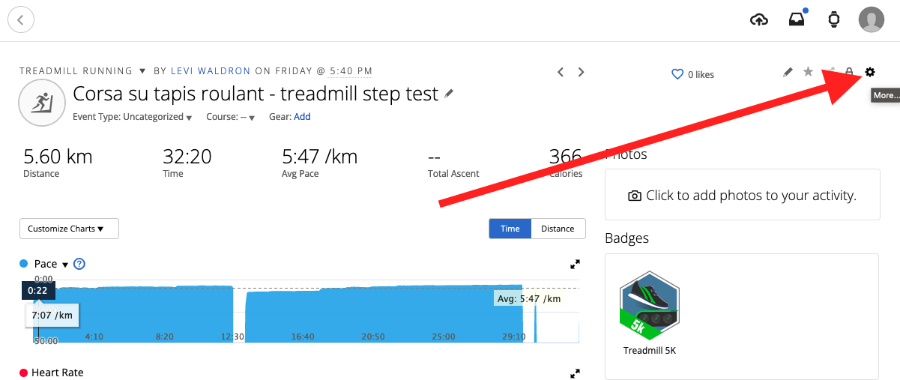

```{r, include = FALSE}
knitr::opts_chunk$set(
  collapse = TRUE,
  fig.width = 6.5,
  comment = "#>"
)
```

# Background

Rationale and validation for this method of estimating anaerobic threshold is described by @Conconi1996-hb, but also disputed e.g. by @Jeukendrup1997-kn and @Hofmann1997-vd (see [References]).

# What this software does

This software provides two functions: 

1. `prepdata()` reads in a TCX file exported from Garmin Connect, Polar Flow, and
probably other fitness apps that record heart rate. It also provides settings for 
the test, such as the start and end time, and the speed and time increments.
2. `fitmodel()` fits a changepoint model with two linear regression lines that
intersect at the estimated anaerobic threshold.

# How to use this software

You can either install it as an R package from CRAN, or use it as an interactive
web app at https://leviwaldron.shinyapps.io/ConconiAnaerobicThresholdTest/. 

# Performing the test

Use a chest strap heart rate monitor if available.

1.  set the treadmill to 1% incline to compensate for lack of wind resistance
2.  warm up by jogging on the treadmill at a slow speed for 10 minutes
3.  rest for 10 minutes with light static or dynamic stretching
4.  start at a low speed where you can still jog, not run, and have several steps before you hit your anaerobic threshold. 6km/h is a likely choice. km/h is likely better than mph for the smaller steps in speed.
5.  spend 90 seconds at each speed. After 90 seconds, increase the speed by 1 km/h
6.  continue until exhaustion, when you can no longer maintain the speed. The test ends and the end of the last segment where the full 90 seconds are completed.

At the end of the test, you can remain still for several minutes with the heart rate monitor still recording, to separately measure and compare rate of recovery. Analysis of heart rate recovery isn't currently handled by this package however.

# Exporting the Garmin TCX file

Open the workout in the web version of [Garmin Connect](https://connect.garmin.com). Click the gearbox in the upper right-hand side:

{width="650"}

Then, export to TCX:

{width="183"}

# Non-Garmin data

Actually you don't need to import a TCX file, what matters for the
`fitmodel()` function is that you provide a data.frame with columns `time`, `heart_rate`, and optionally `speed`.

If you import a TCX file that is not from Garmin Connect, you may need to rename the column containing heart rate to `heart_rate` and the column containing
time to  `time`. The `time` column should be in seconds or a format that
can be coerced to seconds using `as.numeric()`, such as the POSIXct/POSIXlt
formats that most services likely provide. If `useDeviceSpeed` is FALSE, then
the speed column should be `speed`.

# How to figure out startminutes and endminutes

Useful in case the run was started before the start of the actual step test, or ended after.

```{r setup, message=FALSE}
library(ConconiAnaerobicThresholdTest)
```

Note, files in this package are gzipped to save space. TCX files exported as 
above will not have the `.gz` extension and you should not use the `gzfile()`
adapter used below. 

```{r}
fname = system.file("extdata/2023-01-16.tcx.gz", package = "ConconiAnaerobicThresholdTest")
tmp <- prepdata(gzfile(fname), startminutes = 0, endminutes = 100,
          useDeviceSpeed = TRUE)
plot(tmp$minutes, tmp$speed)
plot(tmp$minutes, tmp$cadence_running)
plot(tmp$minutes, tmp$heart_rate)
```

By iteratively adjusting the `startminutes` and `endminutes` and replotting, or just replotting with adjusted axes, I found that the correct start time was at 0.15 minutes and correct end time at 15 minutes.

# January 2023 test

Import the data and show the same plots.

```{r}
dat202301 <- prepdata(gzfile(fname), startminutes = 0.15, endminutes = 15,
          useDeviceSpeed = FALSE)
(dat202301$date = substr(dat202301$time[1], 1, 10))
```

```{r}
plot(dat202301$minutes, dat202301$speed)
plot(dat202301$minutes, dat202301$cadence_running)
plot(dat202301$minutes, dat202301$heart_rate)
```

## Model fitting

This model uses all available data points:

```{r}
fitmodel(dat202301, alldata = TRUE, title = "January 2023, using all HR data")
```

And this model uses only the final 5 measurements in each step:

```{r}
fitmodel(dat202301, alldata = FALSE, title = "January 2023, using only last 5 HR measurements of each step")
```

# Sept 15, 2023 test

```{r}
fname = system.file("extdata/2023-09-15.tcx.gz", 
                    package = "ConconiAnaerobicThresholdTest")
dat202309 <- prepdata(gzfile(fname), startminutes = 23.8, endminutes = 40.1,
          useDeviceSpeed = FALSE)
dat202309$date = substr(dat202309$time[1], 1, 10)
with(dat202309, plot(minutes, speed))
```

## Model fitting

```{r}
fitmodel(dat202309, alldata = TRUE, title = "September 2023, using all HR data")
fitmodel(dat202309, alldata = FALSE, title = "September 2023, using only last 5 HR measurements of each step")
```

# Jan 10, 2022 test

```{r}
fname = system.file("extdata/2022-01-10.tcx.gz",
                    package = "ConconiAnaerobicThresholdTest")
dat202201 <- prepdata(gzfile(fname), startminutes = 26, endminutes = 38.99,
          useDeviceSpeed = FALSE)
dat202201$date = substr(dat202201$time[1], 1, 10)
```

## Model fitting

```{r}
fitmodel(dat202201, alldata = TRUE, title = "January 2022, using all HR data")
fitmodel(dat202201, alldata = FALSE, title = "January 2022, using only last 5 HR measurements of each step")
```

# 2022-23 together

Some plots demonstrating comparison of two tests. First join the two data.frames, and convert date and speed to factors (to make plots appear the way I want them to).

```{r}
xall <- full_join(x=dat202309, y=dat202301) |>
    full_join(y=dat202201) |>
    mutate(date = factor(date)) |>
    mutate(speed = factor(speed))
```

## Boxplot of heart rate vs speed

```{r, fig.width=6.5, fig.height=6.3}
ggplot(xall, aes(x=speed, y=heart_rate, fill = date)) +
    geom_boxplot()  +
    scale_y_continuous(breaks=seq(90, 200, by=10))
```

## Scatterplot with Loess smoothing curve for heart rate vs speed

```{r, fig.width=6.5, fig.height=6.3}
ggplot(xall, aes(x = minutes, y = heart_rate, color = date)) +
    geom_point(size = 0.5)  +
    geom_smooth() +
    scale_y_continuous(breaks = seq(90, 200, by = 10), name = "Heart Rate (bpm)") +
    scale_x_continuous(breaks = seq(0, 16.5, by = 1.5), name = "Time (minutes)", 
                       sec.axis = sec_axis( ~ . / 1.5 + 6, 
                                            name = "speed (km/h)", 
                                            breaks = seq(6, 16, by = 1)))
```

## Scatterplot with Loess smoothing curve for running cadence vs speed

```{r, fig.width=6.5, fig.height=6.3}
filter(xall, date != "2022-01-10") |> # bad cadence data from 2022-01-10
    ggplot(aes(
        x = as.numeric(as.character(speed)),
        y = 2 * cadence_running,
        color = date
    )) +
    geom_point(size = 0.5)  +
    geom_smooth() +
    scale_y_continuous(breaks = seq(150, 200, by = 10), name = "Cadence (spm)") +
    scale_x_continuous(
        breaks = seq(0, 16.5, by = 1),
        name = "speed (km/h)",
        sec.axis = sec_axis(~ . / 1.5 + 6,
                            name = "speed (km/h)",
                            breaks = seq(6, 16, by = 1))
    )
```

# References
